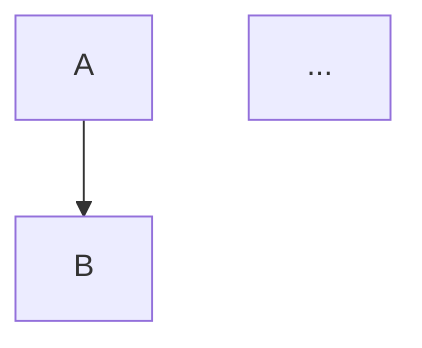
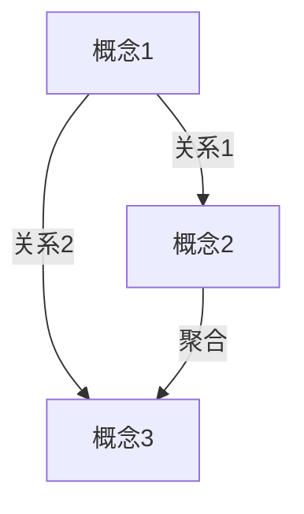

# N=1 Dry-Run Playbook（5 步 25 分钟跑通）

> 适用：第一次给某个飞书 wiki 搭专家大脑，或想验证 schema 改动。
> 全程在 sandbox 节点下，**绝不污染生产数据**。

## 输入

| 参数 | 来源 | 例 |
|---|---|---|
| `space_id` | `lark-cli wiki spaces get_node --params '{"token":"<wiki node token>","obj_type":"wiki"}'` | `<your_space_id>` |
| `parent_node_token` | 同上响应里的 node_token | `<parent_node_token>` |
| `minute_token` | `lark-cli minutes +search` 找到目标场 | `<minute_token>` |
| `date` | today | `2026-05-12` |

## Step 1：列妙记选场次

```bash
lark-cli minutes +search \
  --start <YYYY-MM-DD> --end <YYYY-MM-DD> \
  --format table --page-size 30
```

**N=1 选场标准**（按优先级）：
1. 纯方法论 > 业务讨论 > 客户/财务（含敏感信息的最后选）
2. 30 分钟左右最佳（太短抽不出 5 概念，太长 AI 容易脱锚）
3. 关键词命中 ≥2 个目标 lens 的语料更适合

## Step 2：建 sandbox + Bitable + 12 字段

用一键脚本：
```bash
bash ~/.claude/skills/feishu-expert-brain-architect/scripts/bootstrap_sandbox.sh \
  <space_id> <parent_node_token> "99-Sandbox-<date>"
```

输出：
```
SANDBOX_NODE_TOKEN=...
BITABLE_APP_TOKEN=...
TABLE_ID=tbl...
```

记下这 3 个值，下面所有命令都要用。

## Step 3：拉妙记转写

```bash
mkdir -p /tmp/expert-brain-<date> && cd /tmp/expert-brain-<date>
lark-cli vc +notes \
  --minute-tokens <minute_token> \
  --output-dir ./transcripts
```

输出：
- `./transcripts/artifact-<title>-<token>/transcript.txt`（逐字稿）
- `./transcripts/artifact-<title>-<token>/note.txt`（AI 摘要 + 章节）

⚠️ `--output-dir` **必须相对路径**（坑 9）。

## Step 4：AI 抽 3-5 概念 → Bitable

### 4.1 概念抽取 prompt 模板

```
读 transcript.txt，从这场会议中识别 3-5 个可命名概念。

每个概念必须满足：
- 名字清晰（≤30 字，最好是创造性词汇而非通用术语）
- 有明确的「功能」「反对的对象」「适用场景」
- 在原文有至少 1 句完整 quote 锚定
- 能映射到至少 1 个 lens（觉醒/创业/财富/量化/龙虾/绿皮书）

输出 JSON 数组，每条含：
- concept_name
- type (concept / comparison / synthesis / entity)
- lens (数组)
- maturity (stub / developing，第一次抽通常 developing)
- quote_speaker
- quote_timestamp (HH:MM)
- quote_text (原文 1 句)
- summary (AI 概括 1-3 句)

禁止：
- 编造原文里没有的内容
- quote_text 不在 transcript.txt 里能 grep 到
- 用模糊术语（如「重要」「关键」「显著」）
```

### 4.2 转成 Bitable records JSON

字段顺序：
```
concept_name, type, lens, maturity, sources_url, body, last_reviewed, obsidian_synced
```

body 格式：
```
【原文 <speaker> HH:MM】「<quote>」

【AI 概括】<summary>
```

### 4.3 写入

```bash
lark-cli base +record-batch-create \
  --base-token <BITABLE_APP_TOKEN> \
  --table-id <TABLE_ID> \
  --json "$(cat records.json)"
```

记下返回的 `record_id_list`，下面回填要用。

## Step 5a：综合页（docx）

### 5a.1 建综合页节点

```bash
lark-cli wiki +node-create \
  --space-id <space_id> \
  --parent-node-token <SANDBOX_NODE_TOKEN> \
  --obj-type docx \
  --title "synthesis-<theme>-<date>"
```

记下 `node_token`（用 `wiki spaces get_node` 拿 `obj_token`）。

### 5a.2 写综合页内容

综合页模板（保存为 synthesis.md）：

```markdown
# Synthesis: <主题> @ <date>

> **元信息**
> - 来源妙记：[<title>](<minute_url>)
> - lens：<lens 列表>
> - maturity：developing
> - 概念卡来源：[T01_concepts](<bitable_url>)

## 一句话总结
<整场会议的核心论点>

## N 张概念卡

### 1. <concept_name>
> 「<quote>」—— <speaker> @ <HH:MM>

**功能**：...
**反对的对象**：...

(重复 N 次)

## 概念之间的关系


## 与 LLM-Wiki 候选连接（手工对照）
| 本次概念 | 候选 LLM-Wiki 页 |
|---|---|
| ... | ... |
```

写入：
```bash
LARK_CLI_NO_PROXY=1 lark-cli docs +update \
  --api-version v2 \
  --doc <synthesis_obj_token> \
  --command overwrite \
  --doc-format markdown \
  --content @synthesis.md
```

## Step 5b：协同画板

### 5b.1 建 wrapper docx

```bash
lark-cli wiki +node-create \
  --space-id <space_id> \
  --parent-node-token <SANDBOX_NODE_TOKEN> \
  --obj-type docx \
  --title "whiteboard-<theme>-graph"
```

### 5b.2 插占位 + 拿 board_token

写入 wrapper.md：
```markdown
# <主题> 概念图谱

> 来源 [synthesis](<synthesis_url>)

<whiteboard type="blank"></whiteboard>
```

```bash
LARK_CLI_NO_PROXY=1 lark-cli docs +update \
  --api-version v2 \
  --doc <wrapper_obj_token> \
  --command overwrite \
  --doc-format markdown \
  --content @wrapper.md
```

从响应取 `data.document.new_blocks[0].block_token` 作为 `board_token`。

### 5b.3 写 mermaid

graph.mmd 模板（**保持极简，不要 classDef / 标签 `|`**）：



写入：
```bash
cat graph.mmd | LARK_CLI_NO_PROXY=1 lark-cli whiteboard +update \
  --whiteboard-token <board_token> \
  --source - \
  --input_format mermaid \
  --overwrite \
  --yes
```

## Step 6：回填 + 验真

### 6.1 回填 wiki_doc_url

```bash
lark-cli base +record-batch-update \
  --base-token <BITABLE_APP_TOKEN> \
  --table-id <TABLE_ID> \
  --json '{
    "record_id_list": ["rec1","rec2","..."],
    "patch": {"wiki_doc_url": "<synthesis_url>"}
  }'
```

### 6.2 验真清单（必须 5/5）

打开 4 个 URL 肉眼检查：
- [ ] sandbox 节点：含 3 个子节点（T01 + synthesis + whiteboard）
- [ ] T01_concepts：N 行记录，lens 是多选标签，sources_url 可点击
- [ ] synthesis docx：包含所有 quote，wiki_doc_url 在 Bitable 显示绿色 ✅
- [ ] whiteboard：mermaid 渲染成功，可拖动节点
- [ ] 妙记反向验真：grep 每条 quote 在 transcript.txt 都能找到

## 失败回滚

```bash
# 把整个 sandbox 节点删了，从头再来（不会影响生产）
lark-cli wiki nodes ... delete <SANDBOX_NODE_TOKEN>
```

## 实战数据（2026-05-12 N=1）

| 阶段 | 耗时 | 备注 |
|---|---|---|
| Step 1 选场 | 2 min | 5 候选场次，挑出第 5 场 |
| Step 2 bootstrap | 5 min | 含修 lens 多选坑 |
| Step 3 拉转写 | 1 min | 269 行 |
| Step 4 抽 + 写 | 8 min | 含修 multi_select 报错 |
| Step 5 综合页 + 画板 | 7 min | 含修代理 EOF + mermaid 解析错 |
| Step 6 回填 + 验真 | 2 min | |
| **总计** | **25 min** | 含坑回避后估计 15-18 min |
